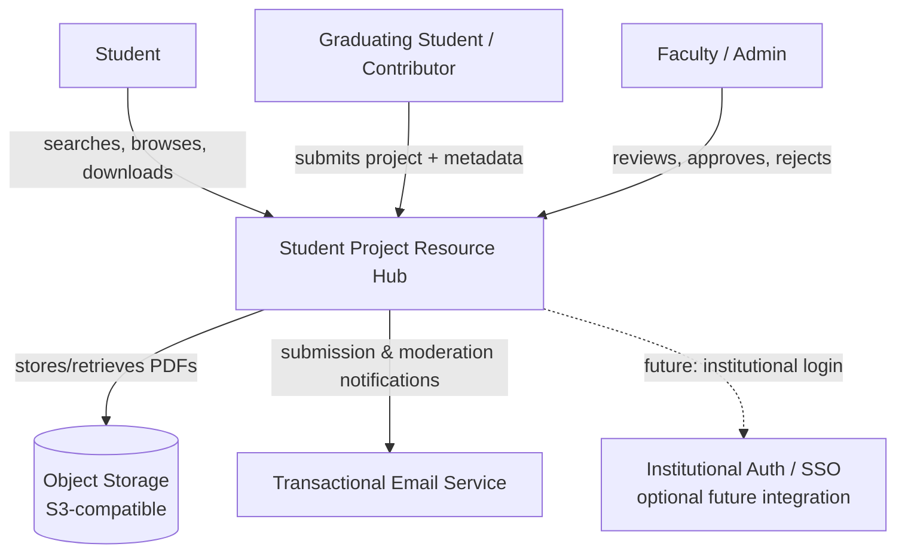
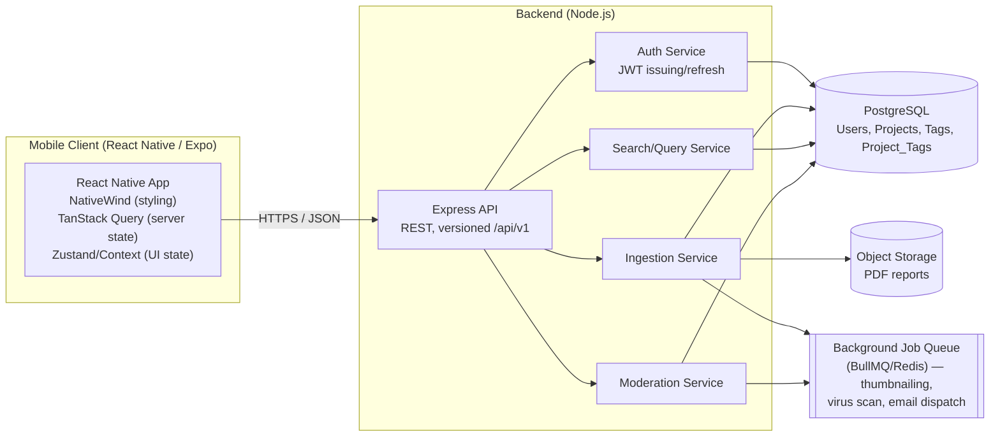
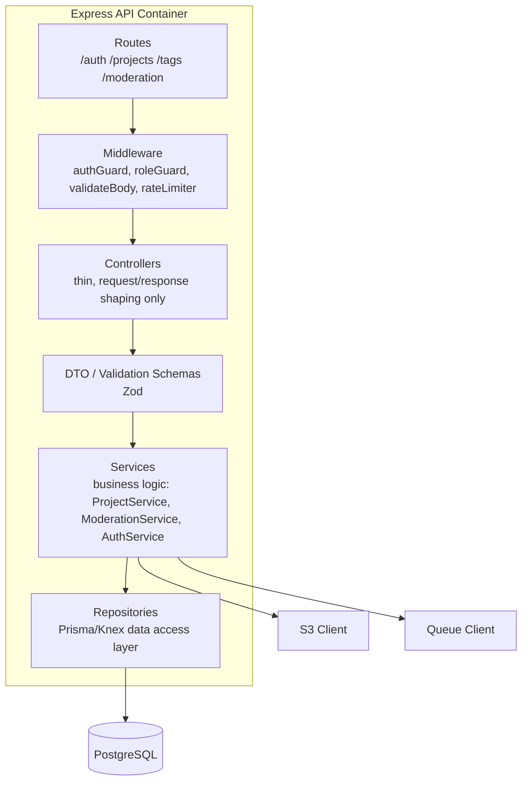
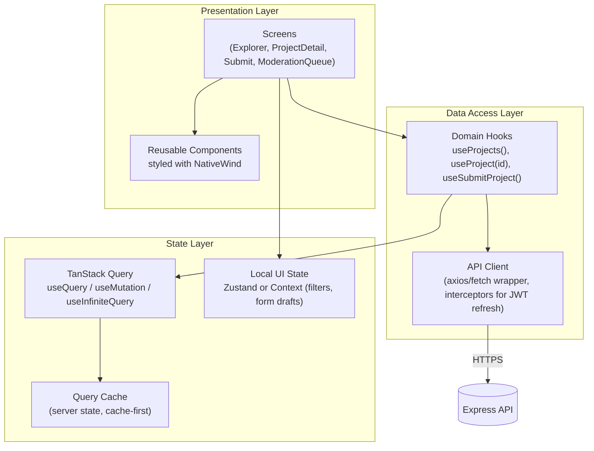
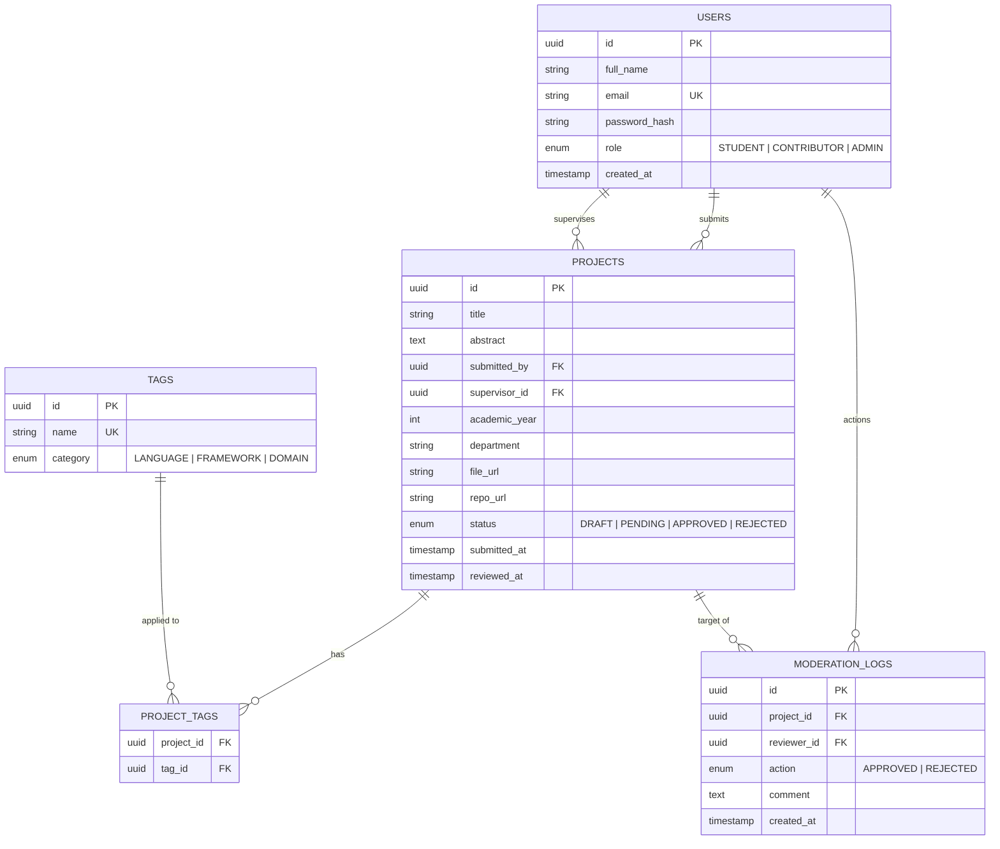
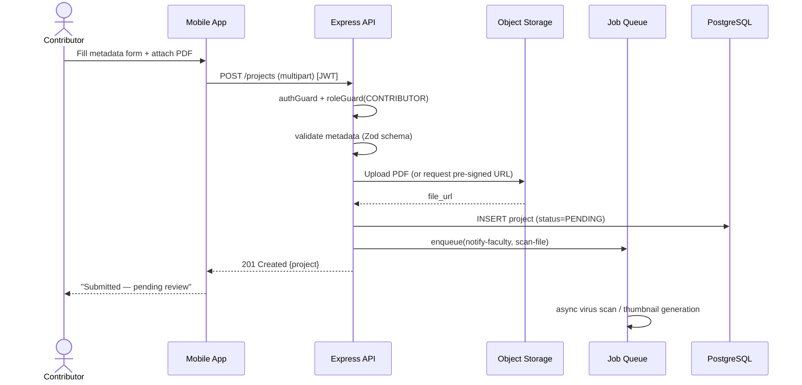
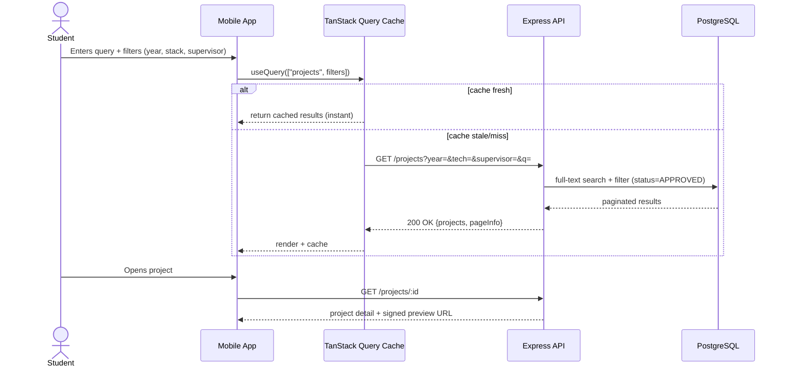
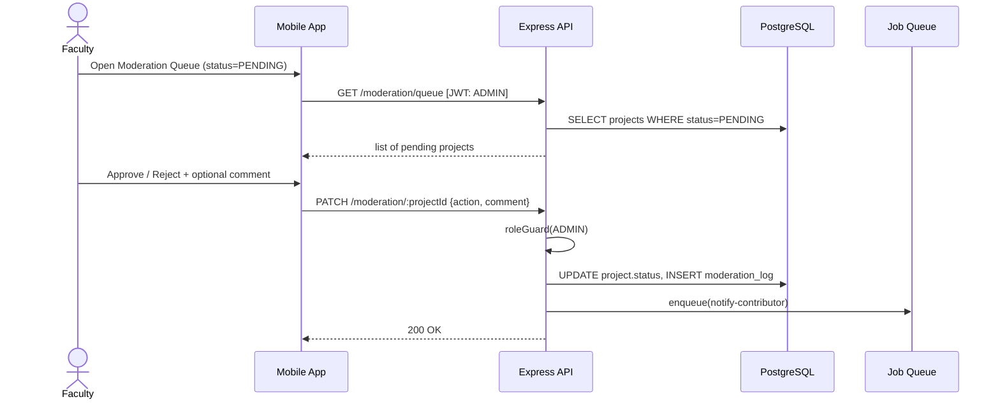
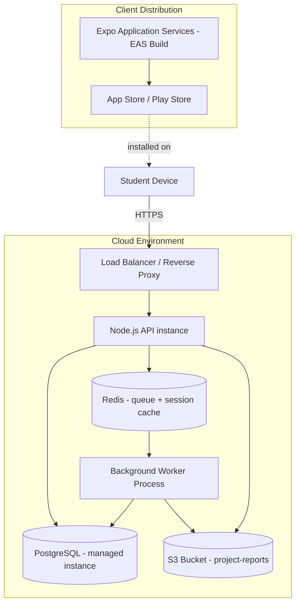

# Student Project Resource Hub — System Architecture Document

**Stack:** React Native (Expo) · TanStack Query · NativeWind · Node.js (Express) · PostgreSQL · S3-compatible object storage
**Audience:** Engineering team, supervisor review, technical documentation archive

---

## 1. Architectural Style

The system follows a **decoupled client-server architecture** with a **layered (n-tier) backend** and a **client-driven cache architecture** on the mobile client. This is documented at three levels of abstraction, loosely following the **C4 model** (Context → Container → Component), which is the appropriate level of rigor for a system with distinct user roles, a moderation workflow, and asynchronous file handling.

- **Context** — how the system fits among its users and external systems.
- **Container** — the deployable units (mobile app, API, database, storage, moderation queue).
- **Component** — internal structure of the API server and mobile client.

---

## 2. Level 1 — System Context Diagram



**Notes:** The system is intentionally bounded — no live code execution environment, no plagiarism engine, no external LMS integration in v1. Auth is self-contained (JWT-based) with SSO left as a future extension point, not a dependency.

---

## 3. Level 2 — Container Diagram



**Container responsibilities:**

| Container            | Responsibility                                                            |
| -------------------- | ------------------------------------------------------------------------- |
| Mobile Client        | Presentation, client-side validation, optimistic UI, server-state caching |
| Express API          | Request routing, auth guards, input validation, orchestration             |
| Auth Service         | Credential verification, JWT issue/refresh, role claims                   |
| Ingestion Service    | Metadata validation, file upload orchestration, draft/pending state       |
| Search/Query Service | Full-text + faceted filtering, pagination                                 |
| Moderation Service   | Approve/reject transitions, audit logging                                 |
| PostgreSQL           | System of record                                                          |
| Object Storage       | Binary PDF storage, signed URL generation                                 |
| Job Queue            | Async, non-blocking side effects off the request path                     |

---

## 4. Level 3 — Backend Component Architecture

A layered architecture keeps HTTP concerns, business rules, and persistence independent — this matters for testability and for swapping PostgreSQL/S3 details without touching business logic.



**Suggested backend folder structure:**

```
server/
├── src/
│   ├── modules/
│   │   ├── auth/          (auth.routes.ts, auth.controller.ts, auth.service.ts)
│   │   ├── projects/      (Resource Explorer + Ingestion)
│   │   ├── tags/
│   │   └── moderation/
│   ├── middleware/         (authGuard, roleGuard, errorHandler)
│   ├── db/                 (prisma schema, migrations, repositories)
│   ├── jobs/                (queue workers: scan-upload, notify-faculty)
│   ├── lib/                 (s3Client, jwt, logger)
│   └── app.ts
├── prisma/schema.prisma
└── tests/
```

**Role enforcement pattern (RBAC at the middleware layer, not scattered in controllers):**

```ts
router.post(
  "/projects",
  authGuard,
  roleGuard(["CONTRIBUTOR", "ADMIN"]),
  validateBody(createProjectSchema),
  projectController.create,
);
```

---

## 5. Mobile Client Architecture (React Native + TanStack Query + NativeWind)

The client separates **server state** (owned by the API, cached via TanStack Query) from **UI/local state** (owned by the client). This distinction avoids the classic anti-pattern of mirroring server data into a global store manually.



**Suggested client folder structure:**

```
app/
├── app/                       (expo-router file-based routes)
│   ├── (auth)/
│   ├── (explorer)/
│   ├── (submit)/
│   └── (moderation)/
├── src/
│   ├── api/
│   │   ├── client.ts           (axios instance, auth interceptor)
│   │   └── endpoints/           (projects.ts, tags.ts, moderation.ts)
│   ├── hooks/                   (useProjects, useSubmitProject, useModerationQueue)
│   ├── components/               (NativeWind-styled, presentational only)
│   ├── stores/                    (Zustand: filters, session)
│   └── types/                      (shared DTO/domain types)
```

**Query-key convention (important for cache correctness):**

```ts
// Hierarchical keys enable targeted invalidation
["projects", { year, techStack, supervisor, department, page }][
  ("project", projectId)
][("moderation-queue", { status: "pending" })];

// After approval mutation:
queryClient.invalidateQueries({ queryKey: ["moderation-queue"] });
queryClient.invalidateQueries({ queryKey: ["projects"] });
```

---

## 6. Data Architecture — Entity Relationship Diagram



_(Note: a `MODERATION_LOGS` table is a worthwhile addition beyond the original scope doc — it gives you an auditable trail of who approved/rejected what, which markers/supervisors typically expect to see in a final defense.)_

---

## 7. Sequence Diagram — Submission Workflow (Ingestion)



## 8. Sequence Diagram — Search & Retrieval



## 9. Sequence Diagram — Moderation Decision



---

## 10. Security Architecture

| Concern                    | Mechanism                                                                                                                      |
| -------------------------- | ------------------------------------------------------------------------------------------------------------------------------ |
| Authentication             | JWT access token (short-lived, ~15 min) + refresh token (httpOnly-equivalent secure storage on device via `expo-secure-store`) |
| Authorization              | Role claims embedded in JWT; enforced server-side via `roleGuard` middleware — never trust client-side role checks alone       |
| Transport                  | HTTPS everywhere; no plaintext API calls                                                                                       |
| File validation            | MIME-type + magic-byte check on upload, file size cap, async malware scan before a file is marked previewable                  |
| Input validation           | Zod schemas at the API boundary; reject unknown fields                                                                         |
| Least privilege on storage | Pre-signed, time-limited S3 URLs — clients never get long-lived direct bucket access                                           |
| Rate limiting              | Applied to auth and submission endpoints to prevent abuse                                                                      |

---

## 11. Deployment Architecture



**Environment separation:** `dev` → `staging` → `production`, each with isolated DB and bucket namespace. Migrations run via Prisma Migrate in CI before deploy, not manually against production.

---

## 12. Non-Functional Architecture Notes

- **Scalability:** stateless API instances behind a load balancer; session/JWT design means horizontal scaling requires no sticky sessions.
- **Observability:** structured logging (pino/winston) + request correlation IDs; moderation actions are logged to `MODERATION_LOGS` for auditability, separate from application logs.
- **Offline tolerance (mobile):** TanStack Query's cache-first strategy allows browsing previously-fetched results with degraded connectivity; mutations (submission, moderation) require connectivity and surface clear pending/error states rather than silent optimistic writes, given the compliance-sensitive nature of moderation actions.
- **Testing strategy alignment:** layered backend architecture supports unit tests at the service layer (mocked repositories), integration tests against a test database, and contract tests on the API surface consumed by the mobile client.

---

_This document is intended to sit alongside Chapter Three (Methodology and System Design) as supporting technical architecture detail, and can be referenced directly in Section 3.5 (System Design) and Section 3.6 (Tools and Technologies) of the project report._
